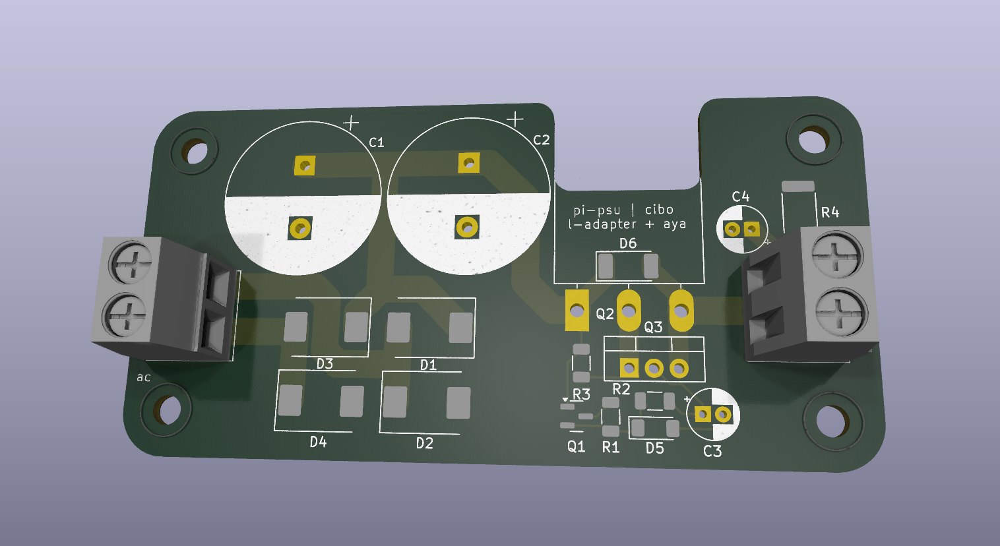

# THE PINS ON BOTH TRANSISTORS ARE FLIPPED FOR BASE AND COLLECTOR. otherwise it works.

# Pi PSU

A **5V linear power supply** designed for Raspberry Pi and similar devices.

## Overview

This project provides a stable 5V output for powering Raspberry Pi boards and other low-power electronics with out using switching supplies.

## PCB Design

Below is a render of the PCB layout:

